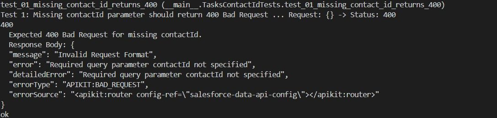
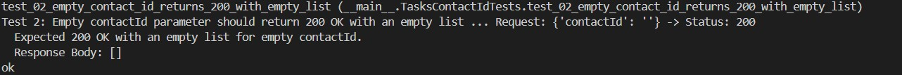
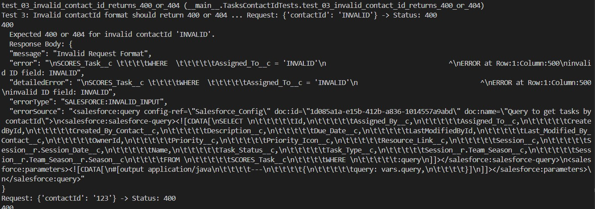
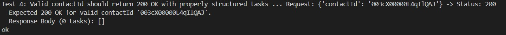

# Tasks API contactId Endpoint Tests

Tests for the `/api/tasks` endpoint that accepts a `contactId` parameter.

## Quick Setup

1. **Install dependencies:**
   ```bash
   pip install requests
   ```

2. **Configure test data** in `QA_Get_Task_WithContact.py`:
   ```python
   cls.base_url = "https://your-api-url.com/api"
   cls.valid_contact_id = "003cX00000L4qIlQAJ"  # Replace with real Contact ID
   ```

3. **Run tests:**
   ```bash
   python QA_Get_Task_WithContact.py
   ```

## Test Cases

| Test | Scenario | Expected Result |
|------|----------|----------------|
| `test_01` | Missing `contactId` parameter | `400 Bad Request` |
| `test_02` | Empty `contactId` (`contactId=''`) | `200 OK` with empty array `[]` |
| `test_03` | Invalid `contactId` formats | `400 Bad Request` or `404 Not Found` |
| `test_04` | Valid `contactId` with existing contact | `200 OK` with task array |

## Success Output Example
```
✅ test_01_missing_contact_id_returns_400 ... ok

✅ test_02_empty_contact_id_returns_200_with_empty_list ... ok  

✅ test_03_invalid_contact_id_returns_400_or_404 ... ok

✅ test_04_valid_contact_id_returns_200_with_tasks ... ok



All essential tests passed!
```

## Common Issues

- **Test 4 fails**: Update `cls.valid_contact_id` with a real Contact ID from your system
- **Connection errors**: Verify `cls.base_url` and network connectivity
- **Field validation errors**: Update `cls.expected_task_fields` to match your API's response structure

## Authentication

Add authentication headers in `setUpClass()`:
```python
cls.headers = {
    "client_id": "your_client_id",
    "client_secret": "your_client_secret",
    "Authorization": "Bearer your_token"  # if needed
}
```